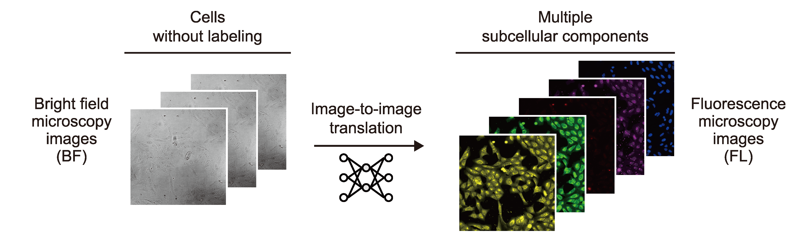
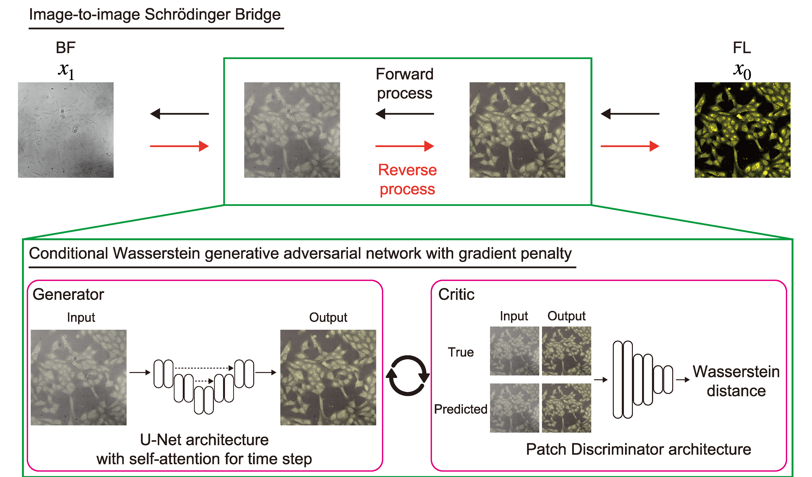

# I2IWSB: Image-To-Image Wasserstein Schrödinger Bridge

This is the code for [Label-free multiplex microscopic imaging by image-to-image translation overcoming the trade-off between pixel- and image-level similarity](hoge).
This project is carried out in [Funahashi Lab. at Keio University](https://fun.bio.keio.ac.jp/).

## Overview

Our model performs image-to-image translation that converts z-stacked bright-field microscopy images 
with 3 channels into images of multiple subcellular components with 5 channels.



The architecture of our model consisted of the I2SB [[1](#ref1)] framework,
which directly learns probabilistic transformations between images, and the cWGAN-GP [[2](#ref2)]
framework, which solves the minimization problem of the
Wasserstein distance between distributions



The detailed information on this code is described in our paper published on [Label-free multiplex microscopic imaging by image-to-image translation overcoming the trade-off between pixel- and image-level similarity](hoge).

## Performance

Input bright-field images were captured as three slices spaced at ±4 μm along the z-axis.
Right panel shows the output images of different models: the ground truth, Palette [[3](#ref3)], 
guided-I2I [[4](#ref4)], I2SB [[1](#ref1)], and our model.
Subcellular components (names of channels that captured them): mitochondria (Mito); Golgi, plasma membrane,
and actin cytoskeleton (AGP); nucleoli and cytoplasmic RNA (RNA); endoplasmic reticulum (ER);
and nucleus (DNA). The models and channel names are described in detail in the Methods section.


Note: 
We used the dataset cpg0000-jump-pilot [[5](#ref5)],
available from the [Cell Painting Gallery](https://registry.opendata.aws/cellpainting-gallery/)  [[6](#ref6)]
in the Registry of Open Data on AWS.

## Requirements

- [Python 3.10.11](https://www.python.org/downloads/)
- [Pytorch 2.0.0](https://pytorch.org/)
- [Matplotlib 3.7.1](https://matplotlib.org/)
- [NumPy 1.24.2](http://www.numpy.org)
- [scikit-image 0.20.0](http://scikit-image.org/)
- [SciPy 1.9.1](https://scipy.org/)
- [Pandas 2.0.0](https://pandas.pydata.org/)
- [scikit-learn 1.2.2](https://scikit-learn.org/)
- [opencv-python 4.8.1.78](https://github.com/opencv/opencv-python)
- [torch_ema 0.3](https://github.com/fadel/pytorch_ema)
- [prefetch_generator 1.0.3](https://github.com/justheuristic/prefetch_generator)

See ```requirements.txt``` for details. 

## QuickStart

1. Download this repository by `git clone`.
```sh
% git clone https://github.com/funalab/ImageToImageWassersteinSchrödingerBridge.git
```
2. Install requirements.
```sh
% cd I2IWSB
% python -m venv venv
% source ./venv/bin/activate
% pip install --upgrade pip
% pip install -r requirements.txt
```
3. Download learned model and a part of datasets.
   - This dataset is a minimum dataset required to run the demo.
   - NOTE: To download the entire dataset, see `datasets/JUMP/README.md`.　you will need about 960GB of storage, so please check in advance whether you have enough space.

    - On Linux:

        ```sh
        % mkdir models
        % wget -O models/i2iwsb.tar.gz "https://drive.usercontent.google.com/download?id=1klNecJvscby4DybfYEJeg8omuaRHQIeT&confirm=xxx"
        % tar zxvf models/i2iwsb.tar.gz -C models
        % wget -O datasets/demo/data.tar.gz "https://drive.usercontent.google.com/download?id=1xXsuKHGft_OpZxGzrthUIZUhYq20JYQW&confirm=xxx"
        % tar zxvf datasets/demo/data.tar.gz -C datasets/demo
        ``` 

    - On macOS:

        ```sh
        % mkdir models
        % curl -o models/i2iwsb.tar.gz -L "https://drive.usercontent.google.com/download?id=1klNecJvscby4DybfYEJeg8omuaRHQIeT&confirm=xxx"
        % tar zxvf models/i2iwsb.tar.gz -C models
        % curl -o datasets/demo/data.tar.gz -L "https://drive.usercontent.google.com/download?id=1xXsuKHGft_OpZxGzrthUIZUhYq20JYQW&confirm=xxx"
        % tar zxvf datasets/demo/data.tar.gz -C datasets/demo
        ```

4. Run the model.
   - On GPU (Specify GPU device name):
        ```sh
        % python src/tools/custom/i2iwsb/test.py --conf_file confs/demo/test.cfg --device cuda:1 --model_dir models/i2iwsb --save_dir results/demo/i2iwsb/test
        ```
   - On CPU:
        ```sh
        % python src/tools/custom/i2iwsb/test.py --conf_file confs/demo/test.cfg --device cpu --model_dir models/i2iwsb --save_dir results/demo/i2iwsb/test
        ```
    The processing time of above example will be about 50 sec on GPU (NVIDIA A100) and about 3000 sec on CPU.

## How to train and run model

1. Train model with the demo dataset.

    ```sh
    % python src/tools/custom/i2iwsb/train.py --conf_file confs/demo/trial/train_fold1.cfg  --device cuda:1
    ```

2. Run model to inference.

    ```sh
    % python src/tools/custom/i2iwsb/test.py --conf_file confs/demo/trial/test.cfg --device cuda:1
    ```


# Acknowledgement

The research was funded by JST CREST, Japan Grant Number JPMJCR2331 to [Akira Funahashi](https://github.com/funasoul).

# References

- <a id="ref1"></a>[[1] Liu, Guan-Horng., et al. "I2SB: Image-to-Image Schrödinger Bridge" arXiv, arXiv:2302.05872 (2023).](https://arxiv.org/abs/2302.05872) 
- <a id="ref2"></a>[[2] Cross-Zamirski, Jan Oscar., et al. "Label-free prediction of cell painting from brightfield images" Scientific Reports, 12, 10001 (2022).](https://arxiv.org/abs/2302.05872)    
- <a id="ref3"></a>[[3] Saharia, Chitwan., et al. "Palette: Image-to-Image Diffusion Models" In ACM SIGGRAPH 2022 conference proceedings, 1-10 (2022).](https://arxiv.org/abs/2111.05826)   
- <a id="ref4"></a>[[4] Cross-Zamirski, Jan Oscar., et al. "Class-Guided Image-to-Image Diffusion: Cell Painting from Bright field Images with Class Labels" In Proceedings of the IEEE/CVF International Conference on Computer Vision, 3800-3809 (2023).](https://arxiv.org/abs/2303.08863)  
- <a id="ref5"></a>[[5] Chandrasekaran, Srinivas Niranj., et al. "Three million images and morphological profiles of cells treated with matched chemical and genetic perturbations" Nature Methods, 21, 1114–1121 (2024).](https://www.nature.com/articles/s41592-024-02241-6)   
- <a id="ref6"></a>[[6] Weisbart, Erin., et al. "Cell Painting Gallery: an open resource for image-based profiling" Nature Methods, 21, 1775-1777 (2024).](https://www.nature.com/articles/s41592-024-02399-z)   
